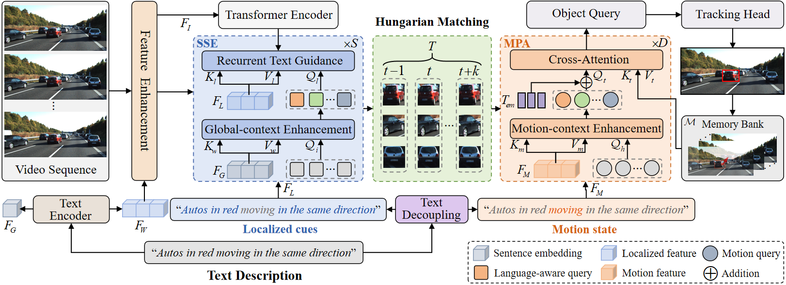

## 🚀 DKGTrack: Language Decoupling with Fine-grained Knowledge Guidance for Referring Multi-object Tracking

**DKGTrack** is a novel Referring Multi-Object Tracking (RMOT) framework that decouples language expressions into localized descriptions and motion states, enabling more precise object tracking guided by natural language.

## 🔧 Features

- **Static Semantic Enhancement (SSE):** Improves region-level vision-language alignment for more discriminative object representations.
- **Motion Perception Alignment (MPA):** Aligns motion expressions with object queries for temporally consistent tracking.

## 🛠️ Setup
git clone https://github.com/acyddl/DKGTrack.git

conda create -n DKGTrack python=3.8 -y

conda activate DKGTrack

For detailed installation instructions and dependencies, please refer to install.md

## 📅 Code Release

The code and pre-trained models will be released **soon**.  
Stay tuned and ⭐ star this repo to get notified!

## 📜 License

This project will be released under the **MIT License**.

## 📫 Contact

If you have any questions, feel free to open an issue or contact us.

