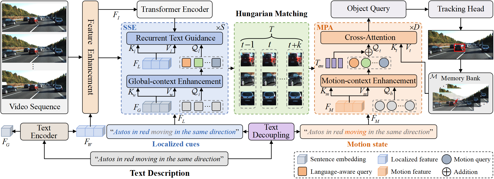

## 🚀 DKGTrack: Language Decoupling with Fine-grained Knowledge Guidance for Referring Multi-object Tracking

**DKGTrack** is a novel Referring Multi-Object Tracking (RMOT) framework that decouples language expressions into localized descriptions and motion states, enabling more precise object tracking guided by natural language.
<p align="center"></p>

## 🔧 Features

- **Static Semantic Enhancement (SSE):** Improves region-level vision-language alignment for more discriminative object representations.
- **Motion Perception Alignment (MPA):** Aligns motion expressions with object queries for temporally consistent tracking.

## 🛠️ Setup
git clone https://github.com/acyddl/DKGTrack.git

conda create -n DKGTrack python=3.8 -y

conda activate DKGTrack

For detailed installation instructions and dependencies, please refer to [install.md](https://github.com/acyddl/DKGTrack/blob/main/Install.md)

## 📅 Dataset
For instructions on downloading and organizing the dataset, please refer to the [TempRMOT repository](https://github.com/zyn213/TempRMOT).

### Training
Before training, you can download COCO pretrained weights from [Deformable DETR](https://github.com/fundamentalvision/Deformable-DETR).

Then, train **DKGTrack** on Refer-KITTI using the following command:
```bash
sh configs/dkgtrack_rmot_train_rk.sh
```
train **DKGTrack** on Refer-KITTI_v2 using the following command:
```bash
sh configs/dkgtrack_rmot_train.sh
```

## 📜 License

This project will be released under the **MIT License**.

## 📫 Contact

If you have any questions, feel free to open an issue or contact us.

